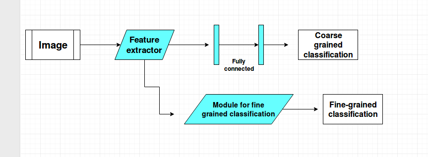

# Coarse and Fine grained Classification

### Problem Statement

The aim of this asssignment is to test the accuracy of an algorithm on the task of coarse and fine grained classification. The given dataset consists of some coarse classes. Each class has some fine classes, each of which in turn consists of some images of the respective coarse and fine class. The task of this assignment is: given some test images, you have to correctly classify it into its correct coarse and fine grained class. For the coarse grained classification, you have to implement the following model:

1.  You have to use a feature extractor for the given image. Some possible choices are using SIFT features or a neural network feature extractor like convolutional neural networks(CNN). You are free to choose any feature extractor but the number of parameters of the network have to be less than or equal to twice the parameters in the standard Resnet network with 18 layers. E.g. you are allowed to use SIFT feature extractor but not the standard Resnet network with 152 layers, as it has more parameters.
2.  You have to use one or more fully connected layers for yielding coarse grained class output. Please refer to the following figure:

For fine grained classification, you are free to choose any algorithm of choice. Some possible methods are:

1.  Using similar architecture as used in coarse grained classification,
2.  Passing concatenated vector(consisting of extracted image features and the one-hot coarse grained class output) and passing through fully connected layers,
3.  Using Bilinear CNNs  
    **but note that the number of parameters should still not be more than twice the parameters of the Resnet-18 network.**

You can divide the given dataset into training, validation and test sets in whichever manner you see fit.

### Approach
We used **CNN with Transfer learning and data augmentation**  to solve the problem. The detailed report can be found [here](report.pdf).

### Result
We achieved approx 98% accuracy an course classification and 84% accuracy on fine classification.

### Code
File Included in code folder:

COARSE :    
    coarse.py : For Coarse Classification

FINE:    
    fine_aircrafts.py 
    fine_birds.py
    fine_cars.py
    fine_dogs.py
    fine_flowers.py

PREDICTION:
    predict.py : run this to get coarse and fine prediction. Assumes models in place. Generates output.txt

### Dataset

The training data can be downloaded from here: [here](https://drive.google.com/drive/folders/1H8H2NS193l78A6xsDyi5iEQpUGlSsn51?fbclid=IwAR0J7KFVd_sdPBCyQwqw5balQHpTLoTxqfdv5pZ_ElMb5IyRS9MDw2ejlyw)
